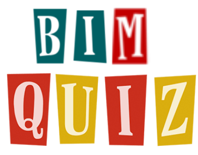

.. BIM QUIZZ documentation master file, created by
   sphinx-quickstart on Thu Mar 28 09:14:33 2019.
   You can adapt this file completely to your liking, but it should at least
   contain the root `toctree` directive.

Documentation du projet réseau
==============================

Fichiers source
---------------

.. toctree::
	:maxdepth: 2
   
   	modules
	
Compte-rendu
------------

:download:`download bimquiz.pdf <bimquiz.pdf>`

Informations
--------------------

.. toctree::
	:maxdepth: 1
   
	Presentation
	Instructions
	Ameliorations
	FAQ
	

Index
-----

* :ref:`genindex`
* :ref:`modindex`
* :ref:`search`

